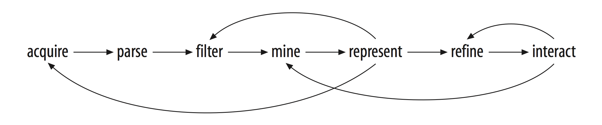
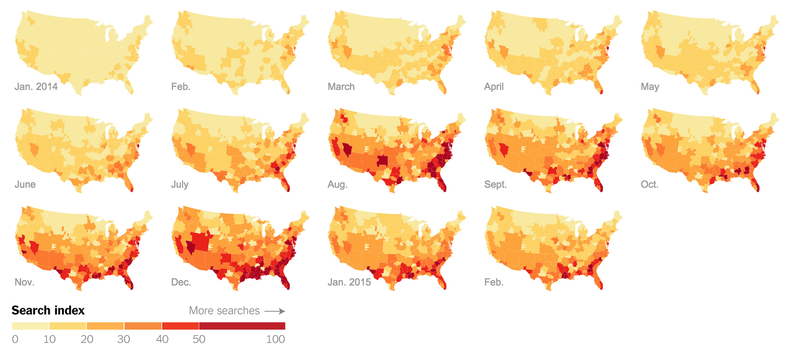
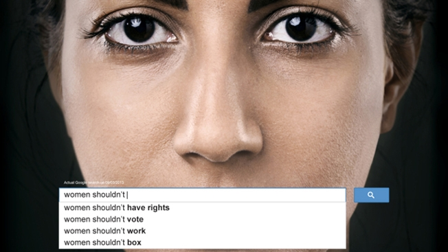

# Final Paper: Draft #2

Gabriel Gianordoli

Thesis Studio 2

Professors Sven Travis and Loretta Wolozin

April 28th, 2015

## I. Concept Statement

### Concept

This project is about cultural big data, more specifically what we can learn about culture and society through Google Searches. At the same time, is a project about what you can't learn from it, because most of this data is kept unavailable to the public.

### Impetus

Today companies and governments collect a large amount of information about its people, from who they interact with to where they are. Some of this data is an important asset that reveals patterns and trends of societies.

With more than a billion users per month, Google's data from searches is a specially relevant example. It is a comprehensive record of our times, and reveals what we love and hate the most from the micro individual level to the macro global one. But only a small fraction of this collection is publicly available, making it impossible to be analysed.

This projects is an attempt to archive and make accessible part of this data. It saves a daily collection of Google Autocomplete predictions, a peek into what people are looking for. It compares searches across multiple languages and media, inviting us to discover what Google says about ourselves.

### Why it Matters

The term big data was first introduced in 2001, by analyst Doug Laney. [laney_3-d_2001] Technically, it is defined as "a broad term for data sets so large or complex that traditional data processing applications are inadequate." [@_big_2015] Laney used the term in the specific context of business intelligence. Since then, the systematic collection of data has spread out to different areas.

Sometimes this data is public and accessible through the platforms themselves. That is the case for social media websites, for example, where users can see their posts and the ones from their friends. In other cases, this data can be downloaded in a reusable format. Some social media platforms and health-tracking devices allow users to do so.

However, data scientist and open data expert Joel Gurin states that to be considered *open*, data "must be publicly available for anyone to use, and it must be licensed in a way that allows for its reuse." [@gurin_big_]

Governments and researchers have been adopting this model in the past years, but access to data from the private sector remains mostly limited in fragmented. Gurin sums up the current state of relations between Big and Open Data in the diagram below.

His opinion that big data could be opened and used for public benefit is also shared by French philosopher Pierre Lévy. He argues that social computing and descentralized communication led to the first digital revolution. According to him, a new revolution will happen when the processing and analysis of big data is made public. “The big data available on the Internet is currently analysed, transformed and exploited by big governments, big scientific laboratories and big corporations. In the future there will be a democratisation of the processing of big data. It will be a new revolution,” [@alvaro_ieml:_] he says comparing the spread of the personal computer and the internet to what might happen with data in the future.

// I included a larger citation of Lévy and double-stated what he said. I think the problem with his quote is that "big" is usually read as "evil..." But his message has more to do with democratization of access than anti-corporativism. I hope it is clear now!

\newpage

## II. Influences

### Domain Diagram

The content-area subject of this project is *cultural big data*. It will approach the issue posed by the concept statement using *data visualization*, through both *online* and *printed media*.

// "Big Data" used to be here... But I moved it to "Why it Matters."

#### Data Visualization

This project defines *data visualization* as the process of giving visual form to data. The concept should not be mistaken by the final visual piece, which is only the last part of a sequence. As data artist Jer Thorp points out "people talk about visualization as a thing(...) A visualization is a noun but it’s a verbal noun, it has a verb built into it. Visualization is a process." [@_ng_]

This idea is also present in the framework described by data visualization expert Ben Fry, which lists seven stages for visualizing data: acquire, parse, filter, mine, represent, refine, and interact. [fry_visualizing_2008]

A broad range of practices can fall into the *data visualization* category though. This project borrows methods from at least 3 of them: database aesthetics, slow data, and cultural analytics.

##### Database Aesthetics

*Database aesthetics* here is considered a subset of information arts, on the intersection with data visualization. It defines works of art that apply the logics and aesthetics of databases, often providing "a way of revealing (visual) patterns of knowledge, beliefs, and social behavior." [@paul_database_2007]

*Information arts* is defined by scholars Christiane Paul and Jack Toolin as works that "explore or critically address the issues surrounding the processing and distribution of information by making information itself the medium and carrier of this exploration." [@paul_encyclopedia_]

This project will apply principles from this practice in its printed form. The idea is to make visible the critical aspects of the research.

##### Slow Data

The term *slow data* was first used by business intelligence analyst Stephen Few, as a reference to *slow food*. While the culinary movement was a response to the spread of fast-food, Few’s target is big data: "I believe that it is time to extend the Slow Movement to the realm of information technology. In this time of so-called big data, too much is being missed in our rush to expand." [@_visual_]

Few argues for a better decision-making process based on big data. His principles apply directly to business intelligence. In this project, slow data is a deliberate strategy to engage users in a critical exploration of data. More than highlight findings, it will serve as a channel for reflection.

##### Cultural Analytics

The expression *cultural analytics* was introduced by researcher Lev Manovich to define both the subject and techniques applied by him and his collaborators in the *Software Studies Initiative*. It argues for a "systematic use of large-scale computational analysis and interactive visualisation of cultural patterns," [@manovich_cultural_2009] utilising of large digital datasets.

This project shares some of the principles of *cultural analytics*, approaching big data as an important cultural record. However, the *Software Studies Initiative* uses mostly media publicly available — digitised works of art or pictures from social media. This project proposes the addition of aggregated search data as an asset in cultural research based on big data.

// Loretta, I ended up not including any examples here. I thought it would be better to focus on the domains instead.
// Manovich’s works are the closest to what I’m making, I think… Even so, I felt like it would be more useful to add non-datavis examples. The next section is full of them. They show analysis of google searches — mostly in journalism, but not necessarily in visualization.

### Google Searches as Analytical Tool

Google made part of its search data available in 2008, with the website *Google Insights for Search*, now *Google Trends*. Since then, it has been used for several different purposes, from analysing politics to predicting the spread of flu. [@_google_]

Seth Stephens-Davidowitz, a former data scientist at Google, combines data analysis with Google Searches to write his articles for The New York Times since 2012. He has written about racism, politics, health, and sex in America. [@_seth_] His methodology inspired a group of researchers to map racism in the US using Google search data. [@chae_association_2015] This approach was recently adopted in a series of visualization from the NY Times as well. They show how fashion trends spread, from State to State. [@tabuchi_fashion_]

Professionals who work with search engine optimization (SEO) also rely on Google searches to make sure their websites show up first on a search page. The strategy involves finding the most searched keywords, either via Google trends or Autocomplete [@_4_], and including them on the website description.

Examples of Google data being used as an analysis tool can be found even in advertising. In 2013, a campaign for UN Women used Google Autocomplete to point out discrimination against women. The predictions, genuinely based on Google data, ended up revealing sexism through searches like “women should stay at home.” [@_women_]

\newpage

## IV. Evaluation

### Status

// Still working on this one. Will have a better idea once I finish the website.

### Learning

#### Skills

This project sums up distinct subjects I got interested in and different skills I have learned along the MFA Design and Technology program. Since my first semester I have attempted to visualise cultural-related data, from sources not always available. I lacked most of the technical skills needed though — web scraping, back and front-end development, experience with non-relational databases —, and some of those projects were never completely finished.

Worse than that, the effort put in their technical aspects was so big that they ended up also lacking focus on the design process. Some succeeded at a given stage, but did not have the breath to iterate over the next. As a result, their visuals, interactivity, and concept were often not consistent enough.

I am glad for having the chance to refine some components of this project. No doubt I owe that to technical improvements I achieved. But a big part of it is also due to finding a better balance between planning and making in my design process.

#### Design Process

Making and thinking cannot be split, and this project helped me confirm that. Planning and realising ideas happens in every stage of a design project, even when there is no user involved. For example, I would never know exactly what data I could have access to without testing several different calls to the Google Autocomplete API.

However it is also pretty easy to get in a technical rabbit-hole when you are conducting a project from start to end.That is why a cycle of user feedback is important in every step. Once I knew the limitations of the source, I discussed with different people what was the most interesting information I could get out of it.

At last, making prototypes is essential to put ideas to test. For example, printing the website page was a feature well-received by most people I talked to. Turns out that no user ever printed a single page, though. It would not be possible to have this feedback if the project was just a concept.

#### Relation to the Community of Practice

This project falls into the data visualization category, but for a long part of its development I refused to frame it like this. I had the impression that the field is often associated with a very specific graphic language — vector-based 2D charts —, and I believed this approach would be limiting.

Besides, a common mistake is to think that visualization always give answers to specific questions. Of course a big part of the field today is dedicated to that, specially when applied to journalism. But the essence of the term has to do with extending human cognition, helping people see what they would not. The extent of that help may vary largely, and should not be always taken as the same as presenting conclusions to an audience. In the book "Software Studies," Richard Wright makes an important distinction that is often ignored: "Visualizations are created for people rather than for machines." [@fuller_data_2008] Although he speaks from the perspective of the software-based applications from the 1980s, the affirmation is true for any data visualisation. As a tool for humans, it can even be used to ask questions instead of providing answers.

Besides, this project changed purposes several times. It began as a personal investigation about Google Autocomplete. It then focused on how translations between media influence the perception of data. At last, it found conclusions on those experiments and changed gears to help people see them.

For that reason, I think that defining domains and communities of practice is important up until the point where it helps finding relevance in a subject. It should not be used as a tool to define what can be done and how, though. None of the experiments of this project would be possible if a specific framing from a given area was imposed on it from the start.

### Envisioning future end states

A careful examination of the Autocomplete predictions proves that some subjects repeat across many different languages, no matter the letter they start with. For example, "cat" (English), "gato" (Portuguese), and "katze" (German). Or, a less obvious one, "periodic table," "tabela periódica," and "periodensystem" — once again for English, Portuguese, and German. I found out about those shared terms by examining the image results. This approach is not scalable though, and depends heavily on human interpretation and cross-examination of the terms.

A programmatic solution could be implemented in the future. It would require some natural language processing algorithms to compare terms across languages, because some translations are not literal. For example, “quotes,” a popular search in English,  translates to Spanish and Portuguese as "citações" and "citas." However, the term used in those languages in this context would actually be "frases."

The solution is even for more complicated when dealing with TV Shows and movies. For instance, the Disney animation "Frozen" is called "La Reina de Las Nieves" (*The Snow Queen*) in Spanish, so no direct translation could match the two.

As for the maintenance of the project, it would be important to save the images and videos instead of just the links. Many of them might be broken in a near future. Also, it would be a way to preserve a more representative snapshot of the Google Searches. The object associated with a specific word might change from time to time, and that is reflected on what Google suggests.

Regarding access, the immediate next step is to create an API to allow other researchers and developers to use the archive data. As stated in Chapter I, data cannot be considered *open* unless it provides a way to be reused.

At last, a great improvement to this project would be the addition of other languages. That would require collaborating with developers from different countries, who could add their own language and also help create a decentralised archive.

\newpage

## References
