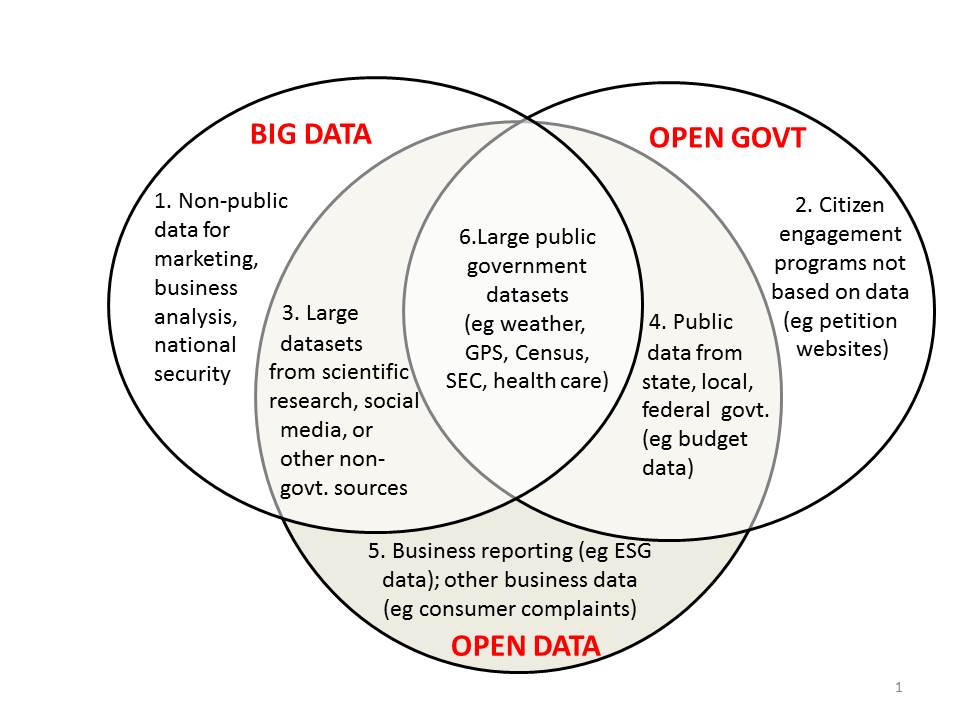
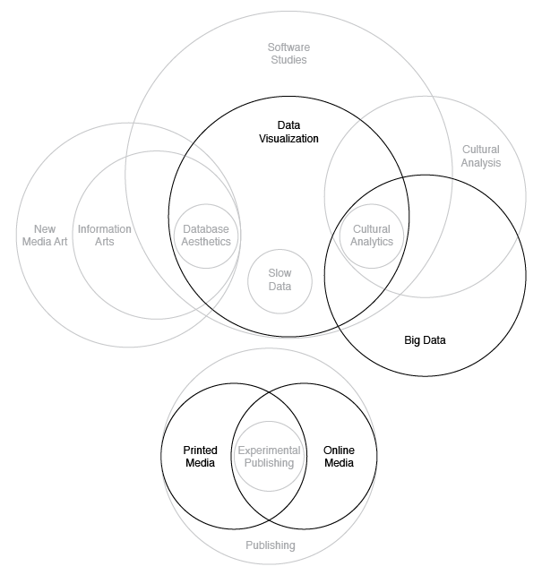

# Final Paper: Draft #2

Gabriel Gianordoli

Thesis Studio 2

Professors Sven Travis and Loretta Wolozin

April 28th, 2015

## I. Concept Statement

### Concept

This project is about cultural big data, more specifically what we can learn about culture and society through Google Searches. At the same time, is a project about what you can't learn from it, because the most part of this data is kept unavailable to the public.

### Impetus

Today companies collect a large amount of information about its users, from who they interact with to where they are. This data is an important asset that reveals patterns and trends of our society and should be used for public benefit.

With more than a billion users per month, Google's data from searches is a specially relevant example. It is a comprehensive record of our times, and reveals what we love and hate the most from the micro individual level to the macro global one. But only a small fraction of this collection is publicly available, making it impossible to be analysed.

This projects is an attempt to archive and make accessible part of this data. It saves a daily collection of Google Autocomplete predictions, a peek into what people are looking for. It compares searches across multiple languages and media, inviting us to discover what Google says about ourselves.

### Why it Matters

The term big data was first introduced in 2001, by analyst Doug Laney. [laney_3-d_2001] Technically, it is defined as "a broad term for data sets so large or complex that traditional data processing applications are inadequate." [@_big_2015] Laney used the term in the specific context of business intelligence. Since then, the systematic collection of data has spread out to different areas.

In the case of social media companies, part of this data is accessible through the platforms themselves. Users of a website can see their posts and the ones from their friends. Sometimes this data can be downloaded in a reusable format by the user, which is the case for most social media and also health-tracking devices, for instance.

However, data scientist and open data expert Joel Gurin states that to be considered *open*, data "must be publicly available for anyone to use, and it must be licensed in a way that allows for its reuse." [@gurin_big_]

Governments and researchers have been adopting this model in the past years, but access to data from the private sector remains mostly limited in fragmented. Gurin sums up the current state of relations between Big and Open Data in the diagram below.

His opinion that big data could be opened and used for public benefit is also shared by French philosopher Pierre Lévy. He argues that social computing and descentralised communication led to the first digital revolution. According to him, a new revolution will happen when the processing and analysis of big data is made public. “The big data available on the Internet is currently analysed, transformed and exploited by big governments, big scientific laboratories and big corporations. In the future there will be a democratisation of the processing of big data. It will be a new revolution,” [@_big_] he says comparing the spread of the personal computer and the internet to what we might see in the future of open data.

// I included a larger citation of Lévy and double-stated what he said. I think the problem with his quote is that "big" is usually read as "evil..." But he's message has more to do with democratization of access than anti-corporativism. I hope it is clear now!

\newpage

## II. Influences

### Domain Diagram

The content-area subject of this project is *cultural big data*. It will approach the issue posed by the concept statement using *data visualization*, through both *online* and *printed media*.

// "Big Data" used to be here... But I moved it to "Why it Matters."

### Data Visualization

This project defines *data visualization* as the process of giving visual form to data. The concept should not be mistaken by the final visual piece, which is only the last part of a sequence. As data artist Jer Thorp points out "people talk about visualization as a thing(...) A visualization is a noun but it’s a verbal noun, it has a verb built into it. Visualization is a process." [@_ng_]

This idea is also present in the framework described by data visualization expert Ben Fry, which lists seven stages for visualizing data: acquire, parse, filter, mine, represent, refine, and interact. [fry_visualizing_2008]

A broad range of practices can fall into the *data visualization* category though. This project borrows methods from at least 3 of them: database aesthetics, slow data, and cultural analytics.

#### Database Aesthetics

*Database aesthetics* here is considered a subset of information arts, on the intersection with data visualization. It defines works of art that apply the logics and aesthetics of databases, often providing "a way of revealing (visual) patterns of knowledge, beliefs, and social behavior." [@paul_database_2007]

*Information arts* is defined by scholars Christiane Paul and Jack Toolin as works that "explore or critically address the issues surrounding the processing and distribution of information by making information itself the medium and carrier of this exploration." [@paul_encyclopedia_]

This project will apply principles from this practice in its printed form. The idea is to make visible the critical aspects of the research.

#### Slow Data

The term *slow data* was first used by business intelligence analyst Stephen Few, as a reference to *slow food*. While the culinary movement was a response to the spread of fast-food, Few’s target is big data: "I believe that it is time to extend the Slow Movement to the realm of information technology. In this time of so-called big data, too much is being missed in our rush to expand." [@_visual_]

Few argues for a better decision-making process based on big data. His principles apply directly to business intelligence. In this project, slow data is a deliberate strategy to engage users in a critical exploration of data. More than highlight findings, it will serve as a channel for reflection.

#### Cultural Analytics

The expression *cultural analytics* was introduced by researcher Lev Manovich to define both the subject and techniques applied by him and his collaborators in the *Software Studies Initiative*. It argues for a "systematic use of large-scale computational analysis and interactive visualisation of cultural patterns," [@manovich_cultural_2009] utilising of large digital datasets.

This project shares some of the principles of *cultural analytics*, approaching big data as an important cultural record. However, the *Software Studies Initiative* uses mostly media publicly available — digitised works of art or pictures from social media. This project proposes the addition of aggregated search data as an asset in cultural research based on big data.

\newpage

## IV. Evaluation

### Status

### Learning

### Envisioning future end states

A careful examination of the Autocomplete predictions proves that some subjects repeat across many different languages, no matter the letter they start with. For example, "cat" (English), "gato" (Portuguese), and "katze" (German). Or, a less obvious one, "periodic table," "tabela periódica," and "periodensystem" — once again for English, Portuguese, and German. I found out about those shared terms by examining the image results. This approach is not scalable though, depending heavily on human interpretation and cross-examination of the terms.

A programmatic solution could be implemented in the future, translating the words and then clustering the results by similarity. The solution is not simple though, because some terms might refer to the same thing in spite of being translated differently. That is the case for TV Shows and movies, for example. The Disney animation "Frozen" is called "La Reina de Las Nieves" in Spanish, so no direct translation could match the two. That also happens for expressions like "love quotes." A literal translation of "quotes" to Spanish and Portuguese returns "citações" and "citas." However, the term used in those languages in this context would actually be "frases."

* Develop and API. As stated before, the archive is the core component of this project. Enabling access to it can help people develop their own applications.

* Save Images. This point is crucial for the maintenance of the project, given that many links to images and videos might be broken in the future. Also, it is a way to preserve a more representative snapshot of the Google Searches. The object associated with a specific word might change from time to time, and that is reflected on the images Google suggests.

At last, implement more languages.

\newpage

## References
