# Final Paper: Draft #1

Gabriel Gianordoli

Thesis Studio 2

Professors Sven Travis and Loretta Wolozin

April 21st, 2015


## III. Methodology

### Scope

The core component of this thesis project is the daily collection of *Google Autocomplete* predictions. It points out to the importance and need to make Google data from searches publicly accessible. This data can be used for multiple purposes and take different forms. I explored some of them with the prototypes listed in the section "Iterative Process" of this chapter. Several other approaches are possible, and I will list some of them on the Chapter "Evaluation.”

The final output utilized in this project showcases some other possibilities. It is comprised of a website and some prints. The former allows users to explore the full dataset of Autocomplete predictions. The latter is a curated collection of subsets of this data: predictions by language, service, and word, for example.

### Approach

Both print and digital media in this project present data visualizations and take the approach of *Slow Data*, described on Chapter 2, "Influences." They both invite users to a slow process of exploration and discovery, instead of a direct visualization of aggregated data.

Each media utilised in this project has its specificities regards to function. The website allows for a full display of the data, as well as an on-demand interaction. The prints have a limited space, but also invite for a more immersive experience. Besides that, each one has its own cultural associations, from which this project tries to take advantage of. This investigation was also part of the goal of this thesis and is discussed in more detail in the section "Iterative Process" of this chapter.

// Loretta, I think this is the core of my "approach." I can say that it is the approach to the final project I'm making. It is a bit confusing because the thesis is larger than that — should I include my approach to programming? To prototyping? To iterative design?

// I'll leave it as is for now, because I think those other "approaches" may fit better into the next section of this chapter (iterative process).


### Iterative Process

// Loretta, it felt more natural to me to tell the process here, before the form. Most of the things I tested here ended up informing my design decisions for the final project.
// Also, I grouped Prototypes and testing.

This project began as an investigation of how *Google Autocomplete* works. The first prototypes invited people to take part in this process, asking them to compare differences across different Google services and have a critical view on the tool. Through those prototypes I could test different ways to present this data, varying the media — digital or print — and the approach — functional or conceptual. Also, the user feedback helped me decide what data to gather in the first place.

Prototypes, testing protocols and the design decisions that resulted from them are presented together in this section. The taxonomy for prototypes used in this section follows the framework presented by Stephanie Houde and Charles Hill on the paper “What do Prototypes Prototype?". [@houdc_what_1997] Early prototypes focused mostly on implementation and role, testing technical aspects or verifying how users would engage with the critical and conceptual approach of the project.

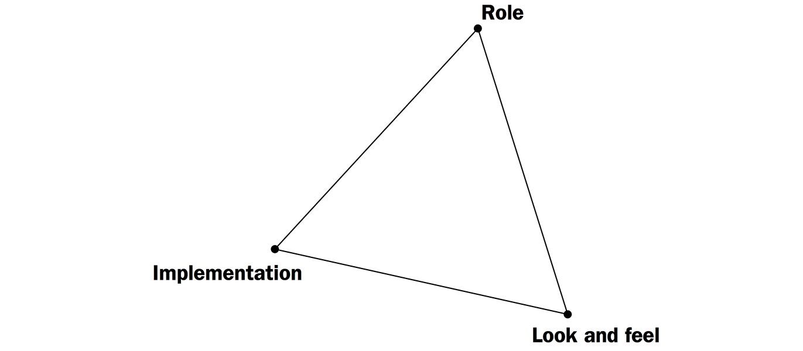

#### Google ABC Online

This prototype was a single-page website with a search bar. The user input on it was restrained to a single letter, which triggered *Google Autocomplete* predictions. Users could them choose one of them and a composite of images forming the input letter would show up. Users could also choose from using *Google Web* or *Google Images*. This prototype was published online and send to some users along with a brief description of the project.

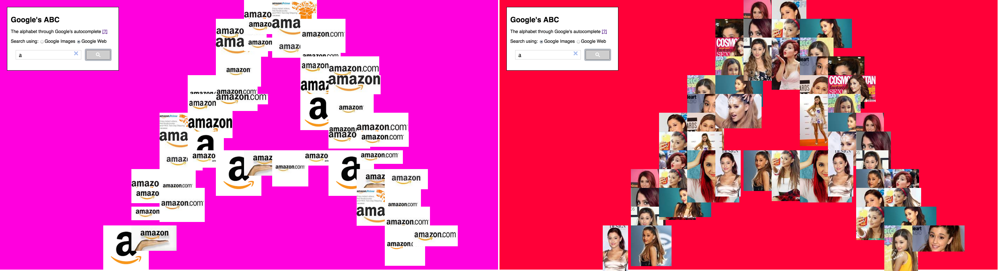

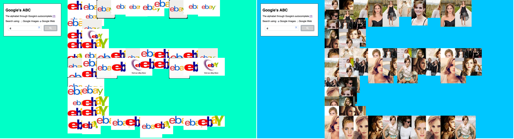

The website pointed out to differences between the predictions on *Google Web* and *Images*. Companies are the most popular topic on the former, while celebrities show up for most of the results of the latter. Although the interface was familiar enough to interact with, its presumed neutrality did not seem to encourage comparison, on an immediate level, nor reflection as an ultimate goal.

#### Google Supersearch

This website served as an implementation prototype, where I expanded the predictions to other Google services: *Youtube*, *Recipes*, *Products*, *News*, and *Books*. Users could type anything on the search box and Autocomplete predictions for all 7 available Google websites would show up as lists. Clicking on a result leads to a search page of the corresponding service.


This prototype was also an attempt to address the comparison problems found in the previous one. Although its purpose was mostly technical, it had a big impact on the conceptual decisions of this project. Its utilitarian aspect, too close to Google's original interface, clashed with the purposes of raising awareness and asking for a critical view from the participants.

#### Google ABC Book

The practical tone of the previous prototype led me to explore a different approach. The strategy in the Google ABC Book was to use a metaphor to evoke cultural associations. Print forms are familiar to many of us, and ABC books in particular are connected to subjects this project was investigating: education, literacy, language, and sources knowledge. This prototype was first developed as a real physical book and then as an interface that mixes digital and print.

Users could access a website and select a Google service. The top suggestion from autocomplete for each letter of the alphabet was then stored. After that, a script performed an image search for each of those terms and places on the page.
The page could be printed on a single sheet and turned into an instant book with a few and simple instructions.

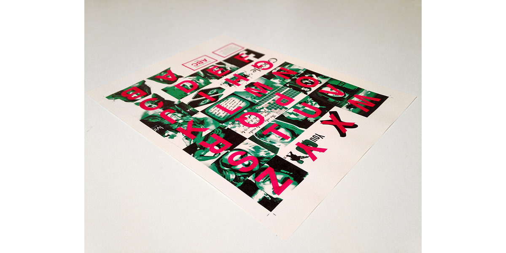

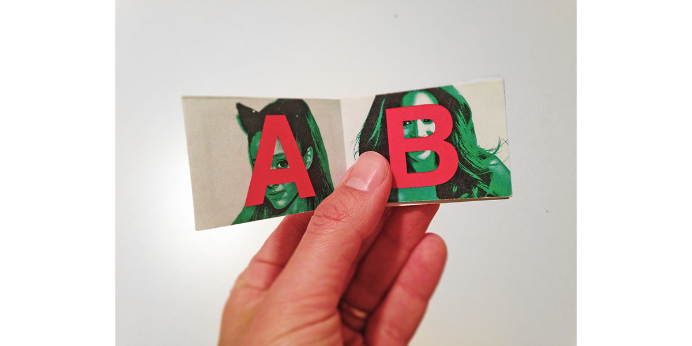


The main areas on which this prototype focused were:

* **Implementation:** check technical aspects, especially related to the web scraper, concerning speed and stability.
* **Role:** questions related to the communicative aspects: is the “ABC Book” metaphor clear? Do people sense a critical tone on the message or not? Does it provoke discussion?

Some of the responses to the communicative aspect of the project were contradicting. Most people understood the project as somewhat critical, though not sure about its precise intention. That was not a major concern, because leaving room for interpretation and discussion was part of the goal of the project.

After the test, some of the users were presented to the printed version of the prototype – none of them printed it from the page. The responses were all positive, as opposed to their opinions about the web page layout. This was an unexpected an yet reasonable problem: since the page was developed as a simple bridge through the source and the print output, not much thought was put into the online experience. As a consequence, users had a limited and frustrating experience because they did not print it.

This feedback was vital for me to decide the final form of this project. Though bridging the gap between the 2 media was an appealing idea, most users simply do not have a printer. Also, users showed different expectations about the content on each medium. Merging them made both limited and unresolved.

For that reason, I decided to split digital and print into separate deliverables, with specific contents. The tools to replicate the prints, as well as the data source, will still be accessible. However, asking people to do make their own prints was no longer a focus of this project after this prototype.

#### Data Filtering Tool

The database application used in this project does not provide a visual interface to query the documents saved. Because of that, I created a web application to help me double-check the Autocomplete results. It features simple html inputs for all possible parameters to retrieve the data: by date, language, letter, and service. Though it was never meant to be an interface for the end-user, I showed it to some people to get a sense of their reactions. Most agreed that having so many options to explore demands too much effort from users. That feedback also influenced the less technical approach of the final project.

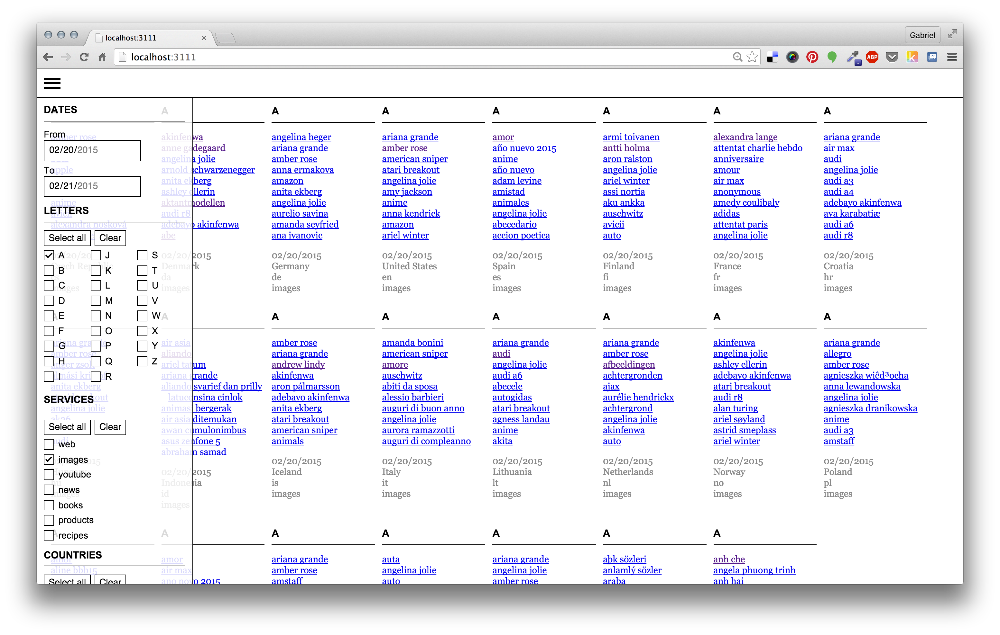

#### Who/What/When/Where/Why/How

This prototype gathers daily predictions from Google Autocomplete for the queries "who," "what," "when," "where," and "why," for the English language only. The words come from a well-know approach for information gathering often referred to as 5Ws. It is utilized in fields like journalism, research and police investigation.

The prototype is a website that displays the data. Users can only see predictions for one day and one word at once. Moving to the right (see images), it is possible to see predictions for previous days. Moving up or down shows predictions based on one of the 5 words.

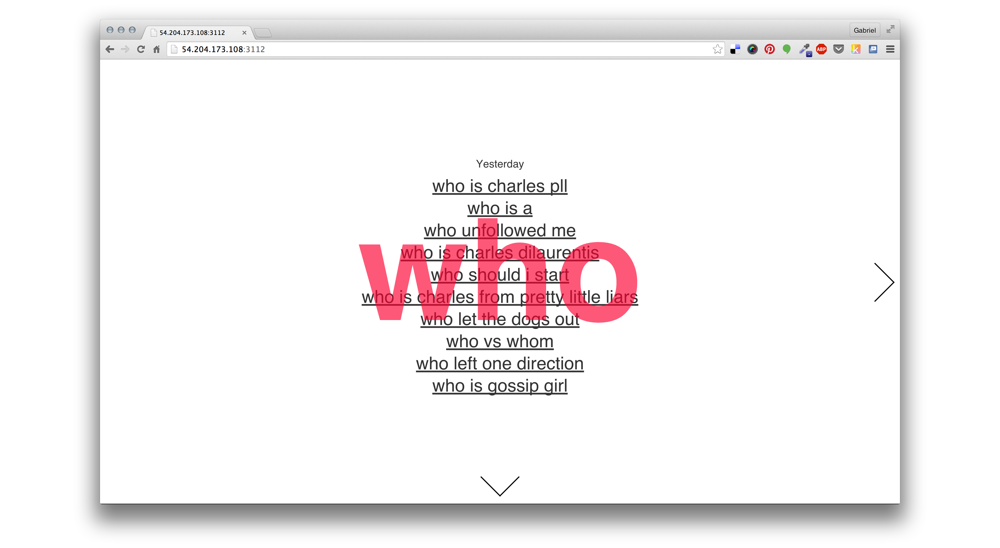

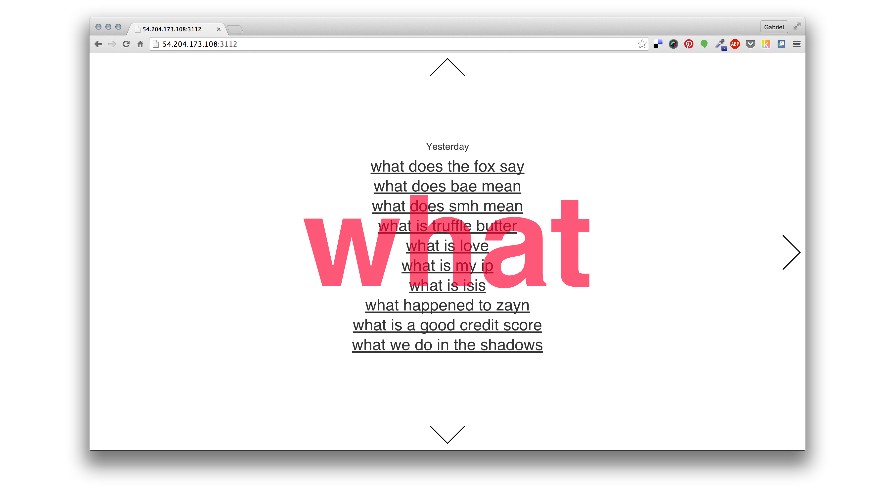

The dataset I used in this prototype is not the same as the alphabetical one which the final project — and most of the prototypes up to this point — is based on. Even so, it was the closest to the final project, because it integrated implementation, role, and look and feel. Especially regarding the role, it embodies the balance between visualization and exploration the other prototypes attempted to achieve.


### Form

The form of this final project can be split into 3 separate parts: the digital archive, the web application, and the prints. The general process follows the framework described by data visualization expert Ben Fry, which lists seven stages for visualizing data: acquire, parse, filter, mine, represent, refine, and interact. [@fry_visualizing_2008] The following diagram shows the process and the technologies used.

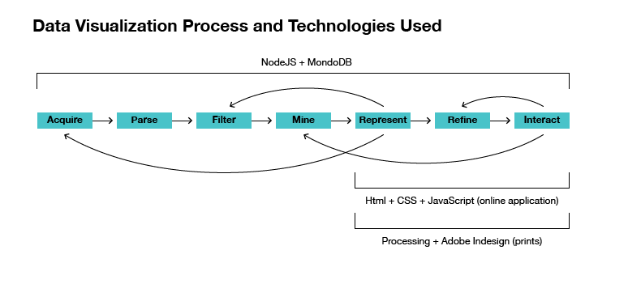

#### Acquire

The data source of this project is Google Autocomplete. The feature is not designed as a way to access Google’s most searched terms, though. A different Google product plays this role: Trends. Launched in 2002, the website provides multiple filters to look up searching data: by country, period, category, and product. Though allowing for several combinations, the service is limited to a single option by filter. For instance, it is not possible to compare searches from two different countries. Also, Google does not provide an API to access the service, restraining access to the dataset to the website UI.

The Autocomplete service does have and API, though it is not documented. [@_google_-1] Even so, it is possible to look up the network requests made to the service by the browser whenever an user types something into the search box. That provides an easy way to tap into the parameters of the dataset request. With those, it is not hard to build an automated way to retrieve the list of predictions.

The limitation of this method is that Autocomplete requires at least one character to return a prediction. This project adopts the bare minimum, looping through the letters from A to Z. This decision is not only a consequence of the technical limitations involved, though. It also reflects the purpose of building an archive that triggers associations with traditional ways of storing information — alphabetically, geographically, and chronological. Those methods allow for the repurposing of this data into familiar print forms, like dictionaries, atlas, alphabet books, calendars, etc. The uncanny effect created by these translations is described in the section "Iterative Process."

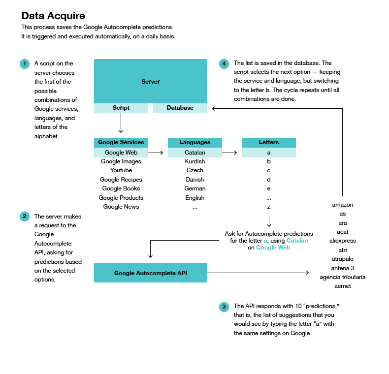

#### Parse, Filter, and Mine

A list of 149 languages is available through Google. [@_google_] However, it is only possible to use the A-Z method with the 79 ones based on the latin script. This list includes the ones like Turkish, which uses the latin alphabet plus some special characters. [@_list_]

After a few days collecting the data, I checked the results manually. From the 79 languages, 47 seemed to return the same results as English, no matter the service requested. The remaining 32 worked fine for Google Web, but not for all other services. That might have to do with several factors that influence the way Autocomplete works (see "FAQ" on the *Appendix*). In this case, probably the search volume for some services is not enough to display predictions. Because of that, the list of languages narrows down as we move from more popular services to least used ones.

At last, most Eastern European languages returned results in a character encoding that was not appropriately parsed in the database. The different encodings have to do not only with the special characters they use, but also with historical facts about the implementation of computers and networks in the region. [@_czech_] Less than 30% of the predictions returned by them presented encoding problems. Even so, a comparison between them and other languages would be incomplete, so I removed them from the archive.


// Loretta, I'll include my FAQ as an Appendix. I'll write it in a more accessible way, so I don't think it fits in here.
// I'm thinking about what else to include there. I have a list that shows the difference between the predictions I get here in France versus the ones a person in Paris gets. I'll put it there for sure.
// I'm not sure if the languages table should come here on this chapter or as an Appendix as well. I feel like this discussion about the language takes away the focus of the chapter a bit. But it is a big part of the PARSE, so I'm not sure.

#### Represent, Refine, and Interact

This project uses images and videos to visualize the terms searched on Google Images and Youtube. To do so, it grabs the first result from a Google search performed for each term. This translation implies moving a bit further from the original data. People searching for a term are not necessarily looking for the first thing Google present them.

This decision was based on 3 reasons. First, images and videos can communicate better the data source, making clear the service from which the search originated. Second, they present a more direct way to visualize the subjects presented. Reducing the amount of verbal information needed to decode the topics allows users to have a broad sense of the topics faster. Third, users presented a special interest in trying to guess the query by looking at the images when presented with the ABC Book prototype. Not having the right answer anywhere on the book was frustrating, they said. But they also argued that having the words along with the images would make the book lose part of its interest. This project tries to balance both arguments, displaying the images and revealing the term as a secondary information.

At last, adding the search results gives an extra layer of information about what Google *thinks* people might be interested in.


This step also involves translating the original database structure to one that is more efficient for the final application. See the section "Data Structures," on the *Appendix*, for more details.

\newpage

##### Print

Creating print archives of the data is an important component of this project. For that reason, part of process of generating these prints is automated by programming scripts. With that, each print ends up being a replicable form, able to contain different combinations of data. The general process of automation is described in the diagram below. Some details may vary depending on the print form.


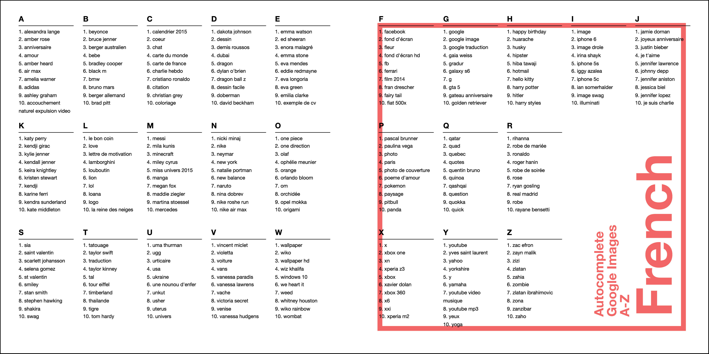


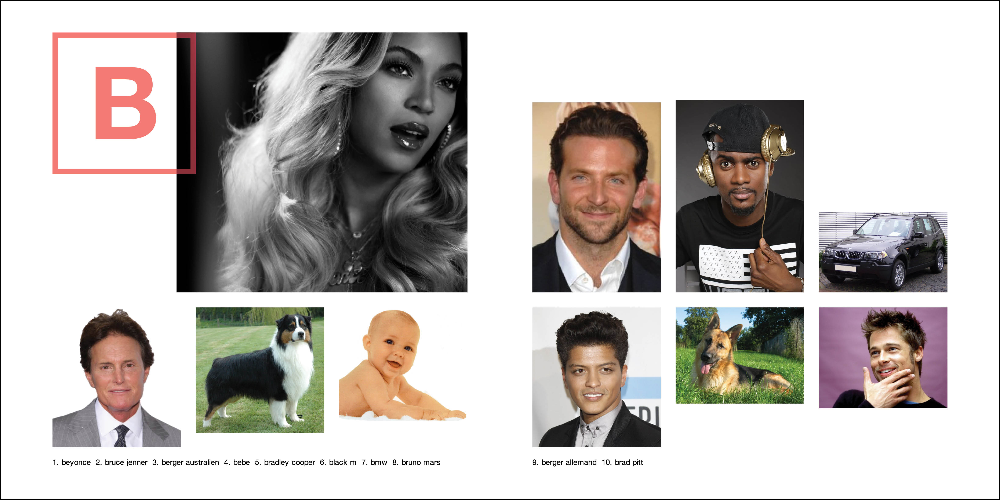


##### Digital

// Here comes a diagram explaining the website I'm making. I'd rather finish the website before drawing this diagram.


\newpage

## Appendix

### Data Structures

// Loretta, I decided to include this here because it is very technical.

All data is saved in MongoDB, a non-relational database. Some of the original data was saved as JSON files as well, as a backup. The different collections used in this project are described below.

#### Original Documents

The predictions saved during the *Acquire* step.

```
[
 {
    "date": "2015-02-19T02:50:26.452Z",
    "service": "web",
    "language": "ca",
    "letter": "a",
    "results": [
      "amazon",
      "ara",
      "as",
      "atri",
      "aliexpress",
      "atrapalo",
      "abacus",
      "abc",
      "antena 3",
      "aeat"
    ]
  }, ...
]
```

#### Records

The main structure used by the final website application. "Ranking" stands for the position of the query in the original list of Autocomplete predictions.

```
[
  {
    "date": "2015-02-19T02:50:26.452Z",   
    "service": "web", 
    "language": "ca", 
    "language_a_name":"Catalan", 
    "letter": "a", 
    "query": "amazon", 
    "ranking": 0 
  }, ...
]
```

#### Images

The list of images and the url of the first result from Google Images.

```
[
  {
    "query" : "batman",
    "url" : "http://upload.wikimedia.org/wikipedia/en/6/67/BatmanRobin.jpg",
    "language_code": "pt-BR"
  }
]
```

#### Youtube

The list of Youtube videos, plus the url and thumbnail of the first result from a search for them on Youtube.

```
[
  {
    "query" : "bruno mars",
    "videoId" : "OPf0YbXqDm0",
    "thumbnail" : "https://i.ytimg.com/vi/OPf0YbXqDm0/hqdefault.jpg"
  }
]
```

### API Abuse and Web Scraping

// Loretta,
the Google API to get the images (Data Preprocessing: Images and Videos) is extremely limited. I ended up using it, though it slows me down a lot.

// Before making this decision, I tried several different methods of getting those images: using a deprecated Google API, writing my own Google Scraper, using a Python Google Scraper, and using the Bing Search API. All had their problems, that's why I settled on the official method provided by Google in the end. Bing was especially interesting. It seems a lot more strict in censoring results. For example, a search for "ISIS" *never* returns anything Islamic State-related. Instead, only images of the Egyptian goddess.

// Anyway, I'm not sure whether or not to include this here, since I ended up not using any of this in the final project.

\newpage

## References
