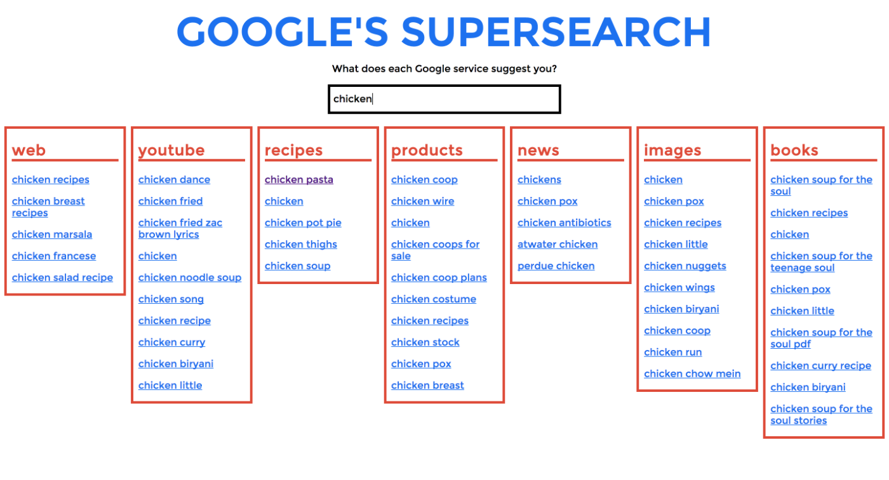

# Final Paper: Draft #1

Gabriel Gianordoli

Thesis Studio 2

Professors Sven Travis and Loretta Wolozin

April 21st, 2015

## III. Methodology

### Scope

The core component of this thesis project is the daily collection of *Google Autocomplete* predictions. It points out to the importance and need to make Google data from searches publicly accessible. This data can be used for multiple purposes and take different forms. I explored some of them with the prototypes listed in the section "Iterative Process" of this chapter. Several other approaches are possible, and I will list some of them on the Chapter "Evaluation".

The final project of this thesis is comprised of a website and some prints. The former will allow users to explore the full dataset oof predictions. The latter will be a curated collection of subsets — predictions by language, service, word, etc.

### Approach

Both print and digital media in this project present data visualizations and take the approach of *Slow Data*, described on Chapter 2, "Influences." They both invite users to a slow process of exploration and discovery through information, instead of a direct visualization of conclusions and findings.

Each media has its specifities regards to function. The website allows for a full display of the data, as well as an on-demand interaction. The prints have a limited space, but also invite for a more immersive experience. Besides that, each one has its own cultural associations, from which this project tries to take advantage of. This investigation was also part of the goal of this thesis and is discussed in more detail in the section "Iterative Process" of this chapter.

// Loretta, I think this is the core of my "approach." I can say that it is the approach to the final project I'm making. It is a bit confusing because the thesis is larger than that — should I include my approach to programming? To prototyping? To iterative design?

// I'll leave it as is for now, because I think those other "approches" may find a better fit into other sections of this chapter.

### Form

### Iterative Process

This project began as an investigation of how *Google Autocomplete* works. The first prototypes invited people to take part in this process, asking them to compare differences accross different Google services and have a critical view on the tool. Through those prototypes I could test different ways to present this data, varying the media — digital or print — and the approach — functional or conceptual. Also, the user feedback helped me decide what data to gather in the first place.

Prototypes, testing protocols and the design decisions that resulted from them are presented together in this section.

The taxonomy for prototypes used in this section follows the framework presented by Stephanie Houde and Charles Hill on the paper “What do Prototypes Prototype?" [@houdc_what_1997]. Early prototypes focused mostly on implementation and role, testing technical aspects or verifying how users would engage with the critical and conceptual approach of the project.

#### Google ABC Online

This prototype was a single-page website with a search bar. The user input on it was restrained to a single letter, which triggered *Google Autocomplete* predictions. Users could them choose one of them and a composite of images forming the input letter would show up. Users could also choose from using *Google Web* or *Google Images*. This prototype was published online and send to some users along with a brief description of the project.

The website pointed out to differences between the predictions on *Google Web* and *Images*. Companies are the most popular topic on the former, while celebritites make up for of the the results of the latter. Although the interface was familiar enough to interact with, its presumed neutrality did not seem to encourage comparison, on an immediate level, nor reflection as an ultimate goal.

#### Google Supersearch

This website served as an implementation prototype, where I expanded the predictions to other Google services: *Youtube*, *Recipes*, *Products*, *News*, and *Books*. Users could type anything on the search box and Autocomplete predictions for all 7 available Google websites would show up as lists. Clicking on a result leads to a search page of the corresponding service.

This prototype was also an attempt to adress the comparison problems found in the previous one. Although its purpose was mostly technical, it had a big impact on the conceptual decisions of this project. Its utilitarian aspect, too close to Google's original interface, clashed with the purposes of raising awareness and asking for a critical view from the participants.

#### Google ABC Book

The practical tone of the previous prototype led me to explore a different approach. The strategy in the Google ABC Book was to use a metaphor to evoke cultural associations. Print forms are familiar to many of us, and ABC books in particular are connected to subjects this project was investigating: education, literacy, language, and sources knowledge. This prototype was first developed as a real physical book and then as an interface that mixes digital and print.

Users could access a website and select a Google service. The top suggestion from autocomplete for each letter of the alphabet was then stored. After that, a script performed an image search for each of those terms and places on the page.
The page could be printed on a single sheet and turned into an instant book with a few and simple instructions.

The main areas on which this prototype focused were:

* **Implementation:** check technical aspects, especially related to the web scraper, concerning speed and stability.
* **Role:** questions related to the communicative aspects: is the “ABC Book” metaphor clear? Do people sense a critical tone on the message or not? Does it provoke discussion?

Some of the responses to the communicative aspect of the project were contradicting. Most people understood the project as somewhat critical, though not sure about its precise intention. That was not a major concern, because leaving room for interpretation and discussion was part of the goal of the project.

After the test, some of the users were presented to the printed version of the prototype – none of them printed it from the page. The responses were all positive, as opposed to their opinions about the web page layout. This was an unexpected an yet reasonable problem: since the page was developed as a simple bridge through the source and the print output, not much thought was put into the online experience. As a consequence, users had a limited and frustrating experience because they did not print it.

This feedback was vital for me to decide the final form of this project. Though bridging the gap between the 2 media was an appealing idea, most users simply do not have a printer. Also, users showed different expectations about the content on each medium. Merging them made both limited and unresolved.

For that reason, I decided to split digital and print into separate deliverables, with specific contents. The tools to replicate the prints, as well as the data source, will still be accessible. However, asking people to do make their own prints was no longer a focus of this project after this prototype.

#### Who/What/When/Where/Why/How

This prototype gathers daily predictions from Google Autocomplete for the queries "who," "what," "when," "where," and "why," for the English language only. The words come from a well-know approach for information gathering often referred to as 5Ws. It is utilized in fields like journalism, research and police investigation.

The prototype is a website that displays the data. Users can only see predictions for one day and one word at once. Moving to the right (see images), it is possible to see predictions for previous days. Moving up or down shows predictions based on one of the 5 words.

The dataset I used in this prototype is not the same as the alphabetical one which the final project — and most of the prototypes up to this point — is based on.

However, it embodied the form and approach of the final project. It displayed the data in a way that asked people to read it, instead of aggregating it.

