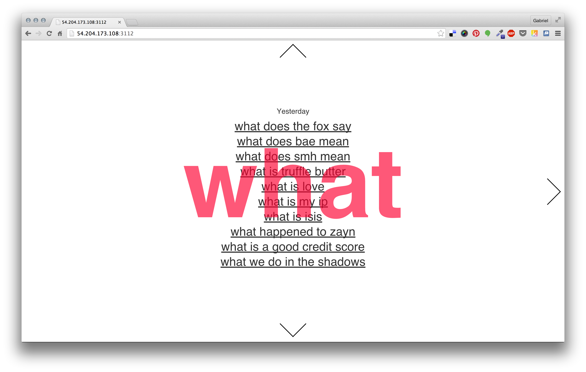

# Testing Protocols

Gabriel Gianordoli

Thesis Studio 2

Professors Sven Travis and Loretta Wolozin

March 31st, 2015

## Concept Statement

Every second today, tech companies collect a large amount of records about people's online behaviours. Often referred to as "big data," these records are important in the study of society and culture. Some of this data is publicly available through the platforms themselves — pictures and comments from social media, for example. A considerable smaller part can be accessed through APIs. In both cases though, public access is limited and fragmented. As a consequence, its use is mostly limited to profit for the companies only.

This project uses Google aggregated search data as an exemplary case of this issue. It will build an archive of daily Google Autocomplete predictions, for multiple countries and products — web, Google Images, Youtube, etc. Users can have access to this information both through an online and a printed output. The former will provide an open tool for research, allowing multiple ways to explore this data. The latter will serve as a channel to communicate and discuss the findings of the project.

The purpose is to raise awareness on the cultural value of this data and answer questions such as: How can it be used in cultural studies? What information does it provide compared to other online sources? What are the the current limitations to its access?

## Testing Protocols

### Prototype

This testing protocol is based on the prototype who/what/where/when/why. This prototype gathers daily predictions from Google Autocomplete for the queries "who," "what," "when," "where," and "why," for the English language only. The words come from a well-know approach for information gathering often referred to as 5Ws. It is utilized in fields like journalism, research and police investigation. 

The prototype is a website that displays the data. Users can only see predictions for one day and one word at once. Moving to the right (see images), is possible to see predictions for previous days. Moving up or down show predictions based on another word.

### Test Goals and Method

The prototype was sent to 10 people as a link to the address [http://54.204.173.108:3112/](54.204.173.108:3112/), by email. Users were either journalists or designers, closer to the expert spectrum of the audience. The ones who were not familiar with the project yet were provided with a brief explanation about the data source. They were prompted to write down their responses to the prototype's interface, visualization, and concept. For each of those, I had the expectation to evaluate specifically:

* Functional aspects of the interface: navigation, responsiveness, and interaction.
* Visualization aspects: comparisons, data structure and hierarchy. Also, the response to the "slow data" approach.
* Conceptual aspects: interest in the data — both in what it shows and how it "works."

### User Feedback

The user feedback falls into one of the categories below. They were split into *positive, negative, suggestion, or question*. Some of the original quotes were edited or merged into others for the sake of clarity.

#### Visual Design and Interface
* Positive
	* "I really like [that you are] keeping it minimal and only focusing on the content."
	* "Looks easy to use for me and I do understand what it does."
	* "The navigation looks trendy."
	* "Looks really elegant."
* Negative
	* "Some flaws on mobile rendering."
	* "The jump from the page to Google seems unnatural. I got lost."
	* "It is confusing to go back to the first date when you navigate vertically."
	
#### Visualization
* Positive
	* "Having horizontally the dates, vertically the different words seems logical."
* Suggestion
	* "When I navigate back in time I would love to clearly see the difference of the ranking."
	* "Is there a way to highlight the changes accross time?"
	* "There should be a way to indicate whether a sentence is going up or down."
	* "It would be interesting to go straight to the first occurrence of a sentence."

#### Concept
* Positive
	* "The historical aspect is particularly interesting."
	* "It was interesting to see things that were popular long ago still show up. And also the questions related to recent things, like ISIS."
	* "Databasing Google’s idea of what we care about as much about humanity as it does about Google."
	* "It makes us curious about ourselves — and about cultural diffeences that might exist."
* Suggestion
	* "Maybe you could also provide some aggregated data for week, month, and year."
* Question
	* "Is it purely informative, or is there more to it?"
	* "Is there any purpose besides the entertaining aspect?"
	* "Does the result vary from country to country?"
	* "Does Google's data vary from person to person?"
	* "How does Google aggregates ths data? Is it a weekly average?"

### Findings

The interface seems to work for the most part. The main thing to be fixed is vertical navigation, that should not change the current date. Besides that, the mobile version needs to be fixed.

Regarding the visualization, people didn't seem bothered by the slow data aspect of it — not being able to see more than one set of results per page. However, visual elements — color differentiation, arrows — could higly improve the comparison accross subsets.

As for the concept, it was partially sucessfull. People's interest in the data — both in questioning the source and pointing out findings — was a positive aspect. The former signals that a FAQ could be an useful addition to the project. The latter proves the research value of the data, one of the goals of the project.

Although, the main concept of the project — which is to advocate for the openness of the data — should not be left out of this prototype. The questions raised by users about what else is there to see make that clear. Improving that is my focus for the next iterations.

